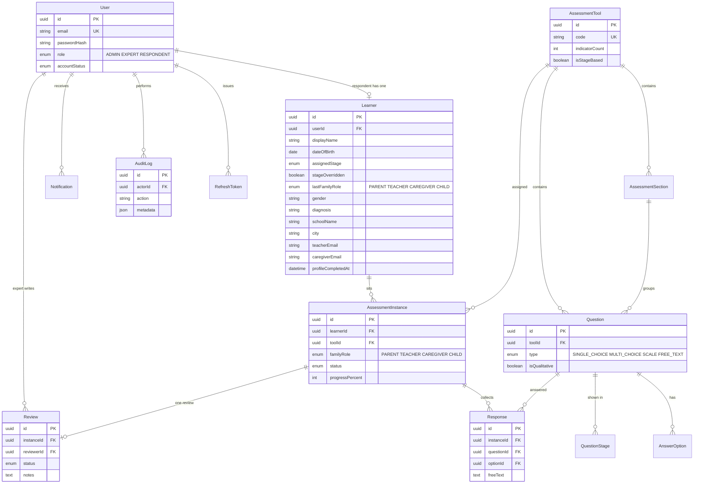

# PVI-CAP Phase 1 — Entity-Relationship diagram

Milestone 1 deliverable. Schema is implemented in `apps/api/prisma/schema.prisma`.

Phase 1 stores responses and review notes. It does **not** compute scores or generate reports.

## Stage bands

| Enum | Ages | Label |
|---|---|---|
| EARLY_CHILDHOOD | 0–5 | Early Childhood |
| PRE_SKILL | 6–10 | Pre-Skill |
| BASIC | 11–15 | Basic |
| INTERMEDIATE | 16–20 | Intermediate |
| ADVANCED | 21–25 | Advanced |

HDMA and VLAP ignore stage filters (all questions). III, CALP, FSIC, and BWRS use `QuestionStage`.

## Phase 1 constraints encoded in the schema

- `Learner.userId` is unique — one learner per respondent.
- `AssessmentInstance` uniqueness `(learnerId, toolId, familyRole)` — one sitting per child, tool, and filler (parent / teacher / caregiver / child). Existing rows migrate as Parent.
- `Response` uniqueness `(instanceId, questionId)` — auto-save overwrites the same row.
- `Review` is 1:1 with an instance.
- `scoringNotes` on questions is stored for PVI’s methodology; the API will not use it to score in Phase 1.
